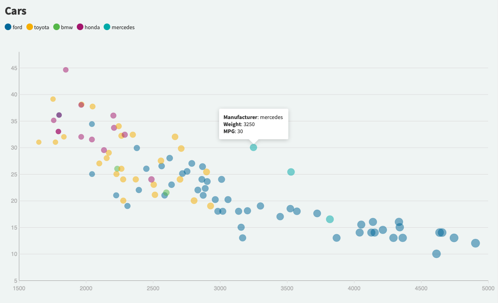
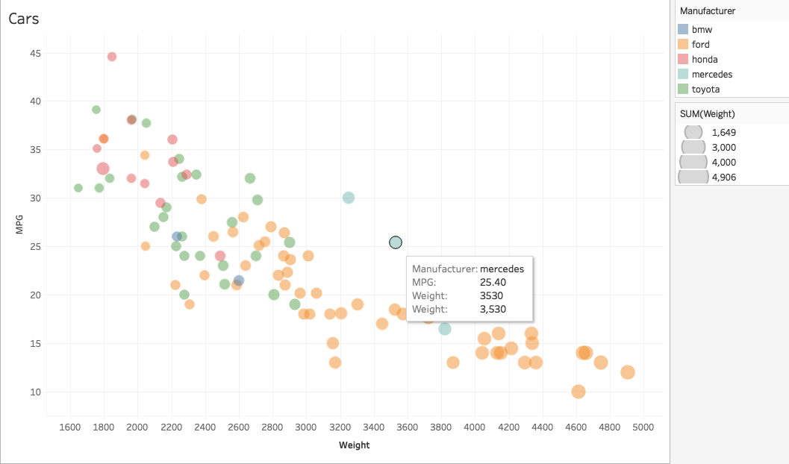
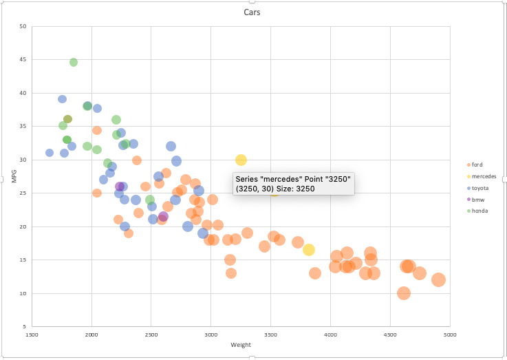

# 02-DataVis-10ways

Assignment 2 - Data Visualization, 10 Ways  
===

# 1.Flourish

Flourish is an free online data visualization tool to import spreadsheet into charts, maps or interaction stories. It is very convient and user friendly even it is the first time I use it. It's user interface is pretty understandable so let users know how to set parameters, how to do size mapping and color mapping. It is a good tool especially for business users if they are not familiar with coding but would like to make interactive chart.

# 2.Tableau

Tableau is a data visualization tool can create sheets and dashboards. To visualize the dataset, I filered the NA values first, changed x, y axises from defaulted SUM to dimension to show every single dot. To make dots more clear, I changed the default color.

# 3. Excel

Excel has basic features of all spreadsheets. In scatter bubble plot, we can do color mapping and size mapping. But before we insert chart, we need to arrange the data manually, then add it series by series. 

# R + ggplot2 + R Markdown

R is a language primarily focused on statistical computing.
ggplot2 is a popular library for charting in R.
R Markdown is a document format that compiles to HTML or PDF and allows you to include the output of R code directly in the document.

To visualized the cars dataset, I made use of ggplot2's `geom_point()` layer, with aesthetics functions for the color and size.

While it takes time to find the correct documentation, these functions made the effort creating this chart minimal.

# d3...

(And so on...)

## Technical Achievements
- **Proved P=NP**: Using a combination of...
- **Solved AI Forever**: ...

### Design Achievements
- **Re-vamped Apple's Design Philosophy**: As demonstrated in my colorscheme...
