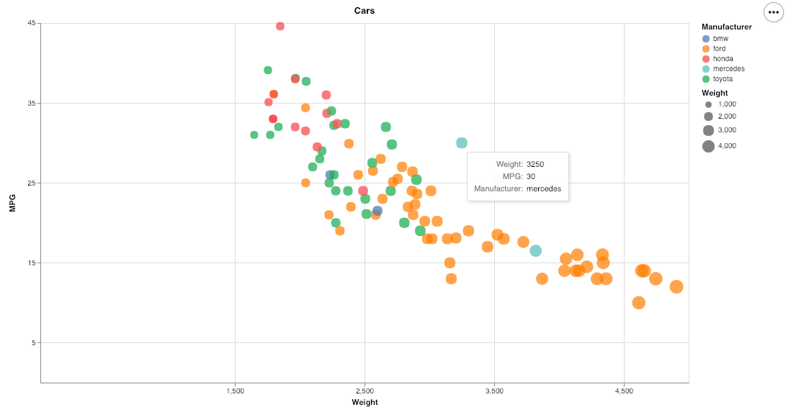
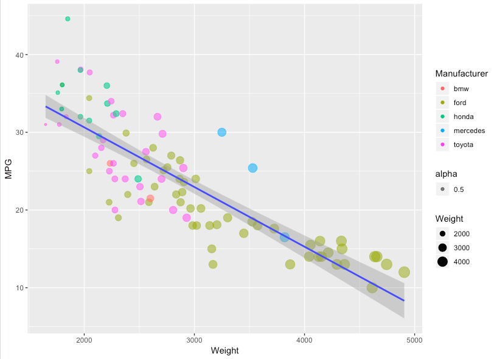
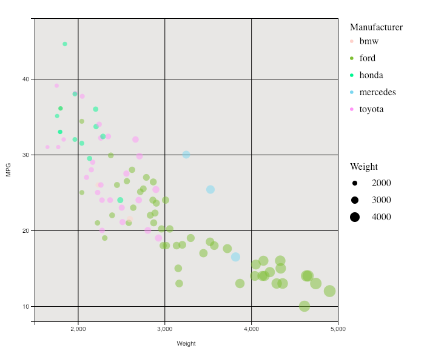
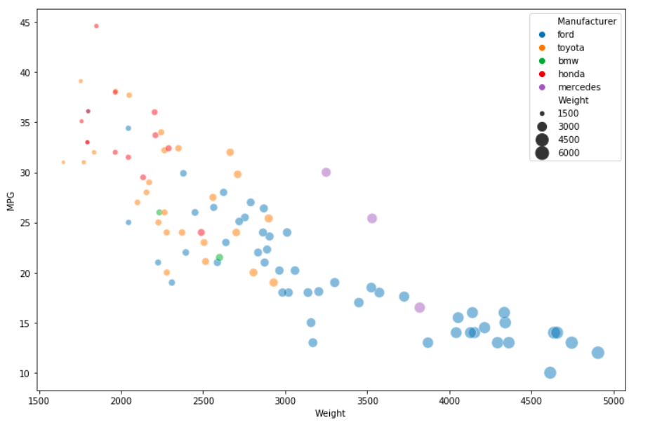
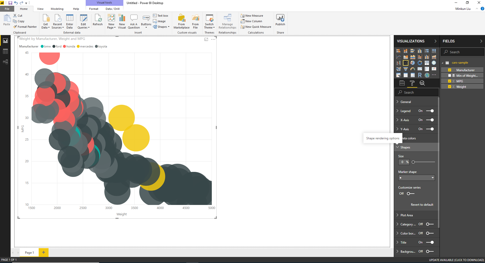
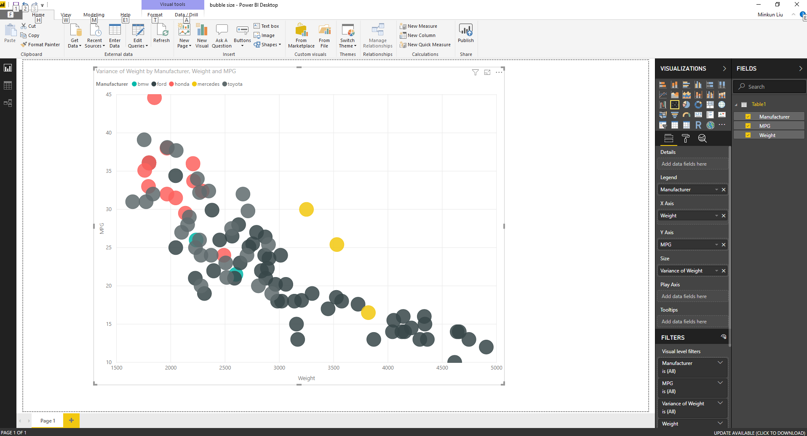
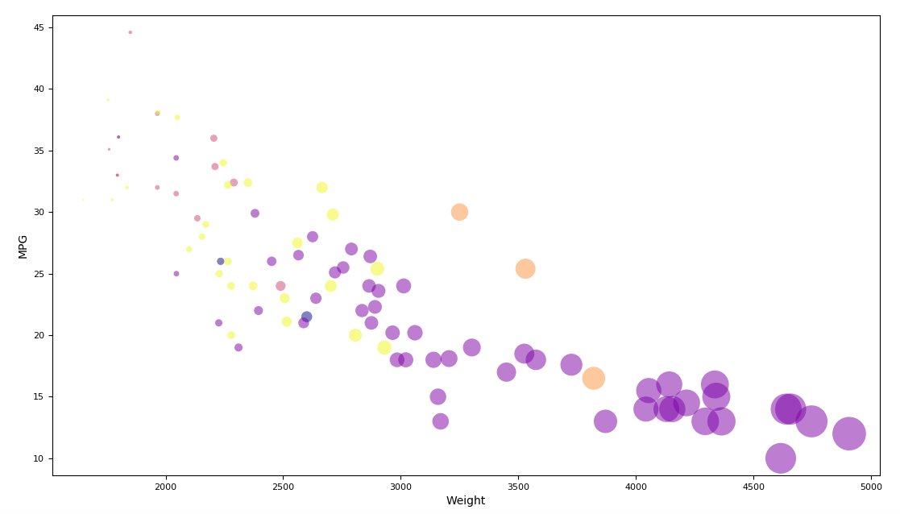
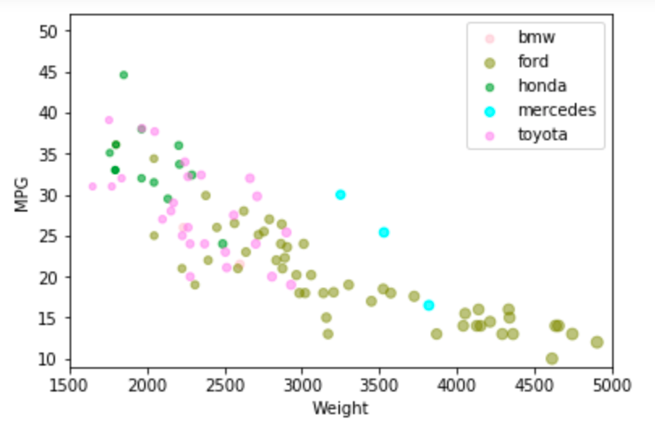
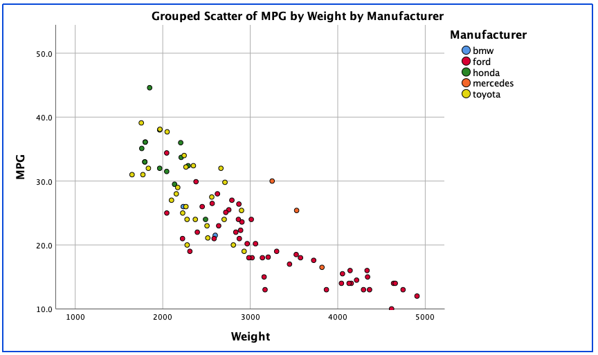

# 02-DataVis-10ways

Assignment 2 - Data Visualization, 10 Ways  
===

# 1.Flourish

Flourish is an free online data visualization tool to import spreadsheet into charts, maps or interaction stories. It is very convient and user friendly even it is the first time I use it. It's user interface is pretty understandable so let users know how to set parameters, how to do size mapping and color mapping. It is a good tool especially for business users if they are not familiar with coding but would like to make interactive chart.

# 2.Tableau

Tableau is a data visualization tool can create sheets and dashboards. To visualize the dataset, I filered the NA values first, changed x, y axises from defaulted SUM to dimension to show every single dot. To make dots more clear, I changed the default color.

# 3. Excel

Excel has basic features of all spreadsheets. In scatter bubble plot, we can do color mapping and size mapping. But before we insert chart, we need to arrange the data manually, then add it series by series. 

# 4. Vega-lite

Vega-lite is the grammer of interactive graphics. It allows us to write directly with concise grammer. To embed vega-lite to website, need to add embed html sentence.

# 5. R + ggplot2

R is a language primarily focused on statistical computing.
ggplot2 is a popular library for charting in R.

To visualized the cars dataset, I made use of ggplot2's `geom_point()` layer, with aesthetics functions for the color and size.I also used 'geom_smooth()'layer to add the regression line.

While it takes time to find the correct documentation, these functions made the effort creating this chart minimal.

# 6. d3...

D3.js is a JavaScript library for producing dynamic, interactive data visualizations in web browsers. In this assignment, I treid new API such as scaleLinear, scaleOrdinal to realize the requirement.

# 7. TIBCO Spotfire

Spotfire is the fastest analytics tool for getting insights from data. It is intelligent to do color mapping and size mapping, to change the opacity, just go to visualization properties and change transparency in appearance. But it is not friendly to mac user, because the transparency only can be set in the windows desktop.

# 8. Python+Seaborn

Python is an interpreted, high-level, general-purpose programming language. Seaborn is a Python data visualization library based on matplotlib.

# 9. Power BI

Power BI is a business analytics service provided by Microsoft. It provides interactive visualizations with self-service business intelligence capabilities. However, for this assignment, the biggest problem is that it is aggregate automatically. Even I set the 'Weight' as the size dimension. and drag the scale to the 0%, the bubbles in the chart are still very big and overlapping with each other. I put this issue in the Power BI community, and the support team provide suggestion that I can use variance to weight, but still there is the problem, the bubbles size not scaling by Weight. Here is the link the issue I post:https://community.powerbi.com/t5/Desktop/Scatter-plot-dot-size-issue/m-p/614381/highlight/false#M292851

# 10. Glueviz

Glue is a python library can create scatter plots for data, but the difference of circle size is too broad, which leads the circles with low value are too small.

# 11. Matplotlib

Matplotlib is a plotting library for the Python programming language and its numerical mathematics extension NumPy. In this case, I also use pandas to load csv data file.

# 12. SPSS

I also tried to use SPSS to finalize all requirements, but unfortunately, seems like that SPSS couldn't do the size mapping to one value. The transparency can be change, but the result couldn't tell difference between before and after. Additionally, the user interface of SPSS are too old to use.

In this different ways, I think Tableau is the most professional data visualization tools, it doesn't have size issue like Power BI has, users can realize customized design in this tool. Tools like Flourish and Spotfire are easy to use but can't realize too much interaction functions. Using languages is definitely free and customized, but some has high level requirement for coding experience, especially need to switch from one language to another.

## Technical Achievements
Using a combination of tool, library, and language. Have tried as many different ways as I can, and explore the function as much as i can of every tool.

### Design Achievements
I think the data chart should be concise and east to read, so I keep the each brand value's color differentiate with each other to make data clear.
